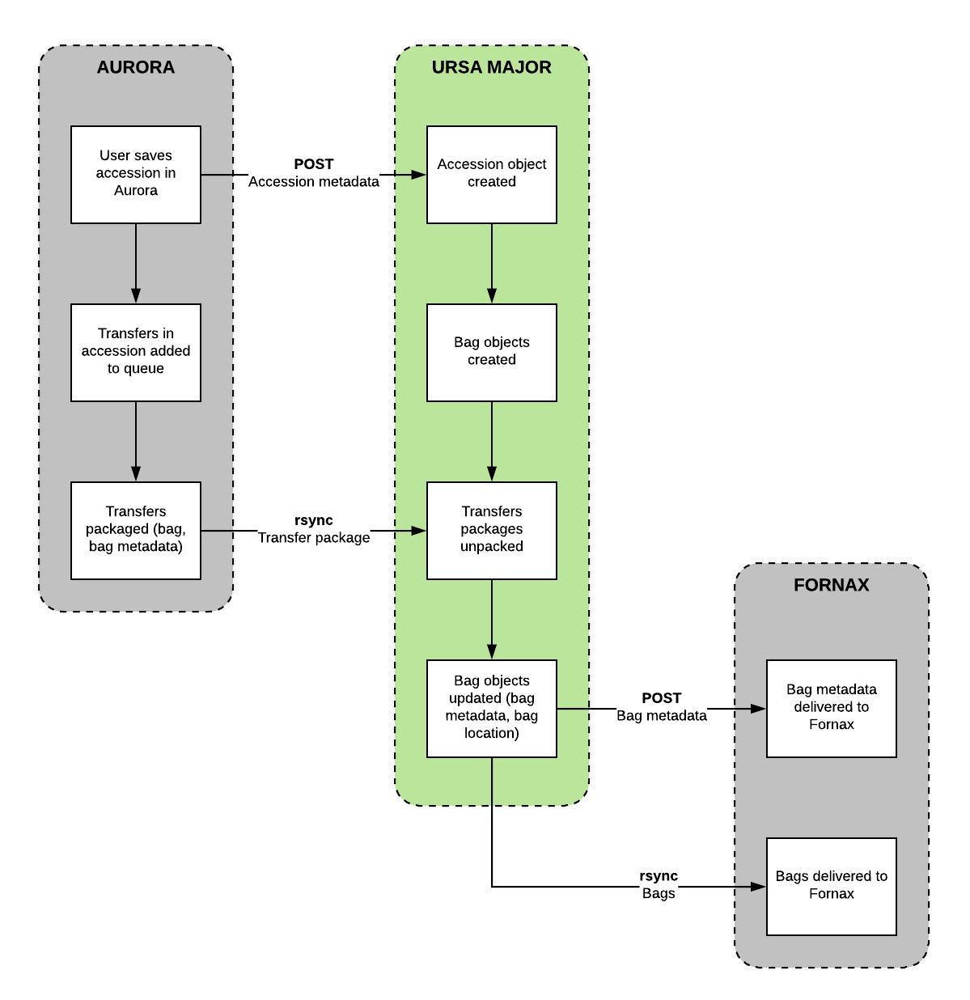

# Ursa Major

A microservice to discover and store bags.

## Installation

### Quick Start
If you have [git](https://git-scm.com/) and [Docker](https://www.docker.com/community-edition) installed:

      git clone https://github.com/RockefellerArchiveCenter/ursa_major.git
      cd ursa_major
      docker-compose up

To shut down Ursa Major, run:

      `docker-compose down`

or, if you wish to remove all local data:

      `docker-compose down -v`

## Usage

When a POST request is sent to the `accessions` endpoint with a payload containing valid accession data, an Accession object is created as well as a Bag object for each transfer identified in the `transfers` key of that data.

Bags are discovered and processed on a regular basis when the `BagStore` cron job is run or when a POST request is sent to the `bagdiscovery` endpoint. If the files for a bag do not exist (or are in the process of being transferred) that bag is skipped until the next time the routine is run.

Bag Discovery consists of the following steps (the `BagDiscovery` class):
- Checking to see if the files for the bag are in the landing directory
- "Unpacking" the bag files and saving the metadata to the Bag object
- Moving bag to the storage directory and updating the `bag_path` field
- Notifying Fornax that the bag is available for further processing via a POST request

### Routes

| Method | URL | Parameters | Response  | Behavior  |
|--------|-----|---|---|---|
|POST|/accessions||200|Creates accession objects as well as associated bags|
|GET|/bags| |200|Returns a list of transfers|
|GET|/bags/{id}| |200|Returns data about an individual transfer|
|POST|/bagdiscovery||200|Runs the BagDiscovery routine|
|GET|/status||200|Return the status of the microservice|

## License

This code is released under an [MIT License](LICENSE).
